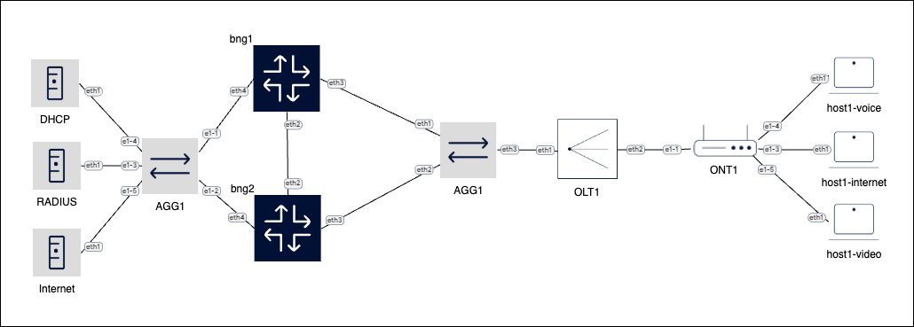

# BNG LAB

## Description
The following lab simulates a Nokia SR-OS BNG deployment with a single GPON user with ONT and three hosts (internet, voice and video).

Deployment model is VLAN per user using capture-sap in the BNG along with RADIUS authentication and external DHCP server for IPv4 addressing.

## Topology

